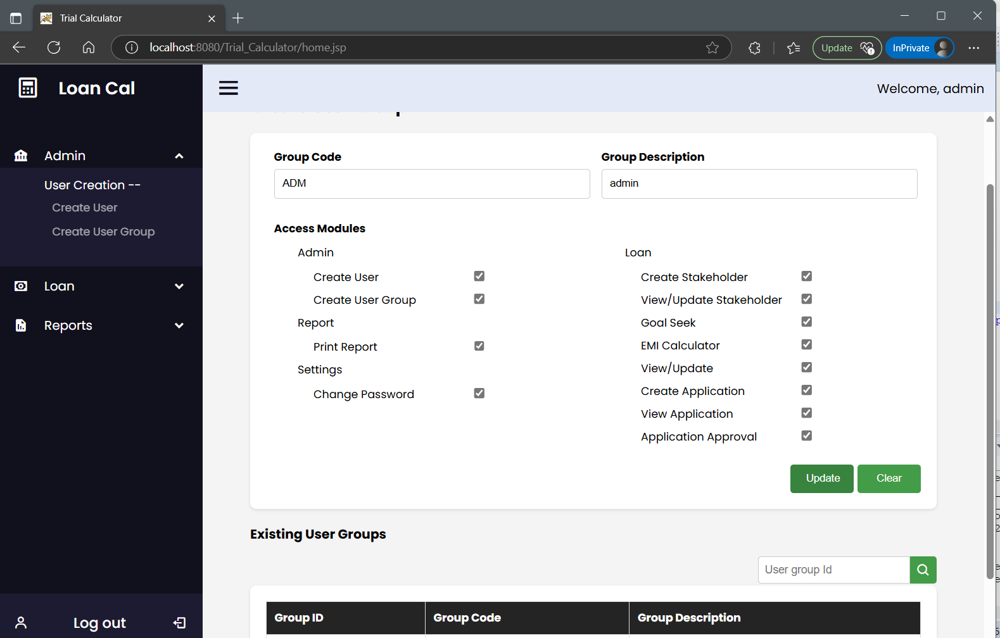
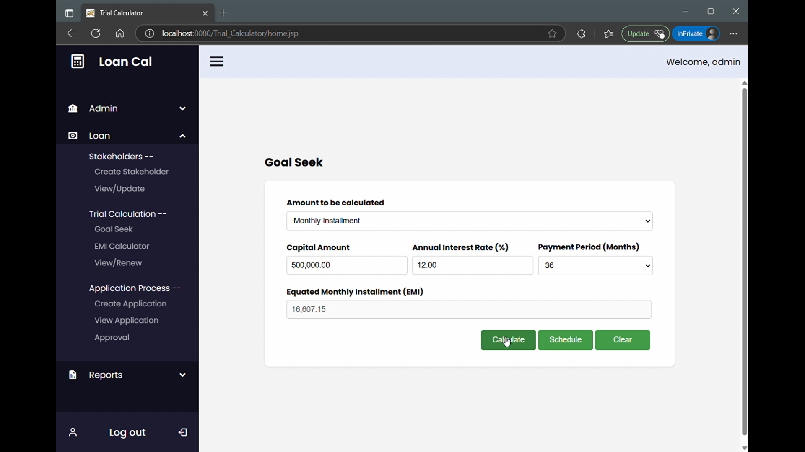

# Loan Management System

## Overview

A Loan Management System built with **Java (Spring, Hibernate, Struts)** following **MVC architecture**. The frontend is developed using **HTML, CSS, and JavaScript**, and **MySQL** is used as the database. Developed in **Spring Tool Suite (STS) IDE**.

## Features

### 1. Admin Module

- Create user groups with specific access rights.
- Create users and assign them to groups with predefined permissions.

### 2. Loan Module

- **Client Management**: Create, view, and update client details.
- **Trial Calculation**: Perform trial calculations, goal-seeking, and update trial calculations.
- **Application Process**: Create, view, and approve loan applications.

### 3. Report Module

- Generate and view reports related to loans and clients.

## Tech Stack

- **Backend**: Java, Spring, Hibernate, Struts
- **Frontend**: HTML, CSS, JavaScript
- **Database**: MySQL (Hibernate auto-generates tables)
- **Architecture**: MVC
- **Build Tool**: Maven
- **IDE**: Spring Tool Suite (STS)

## Installation & Setup

1. Clone the repository:
   ```bash
   git clone https://github.com/your-username/loan-Management-System.git
   ```
2. Open the project in Spring Tool Suite (STS).
3. Install Maven if it's not already installed. You can download it from the official Maven website.
4. Build the project using Maven:
   ```bash
   mvn clean install
   ```
   This will download the necessary dependencies and build the project.
5. Create a MySQL database named:
   ```sql
   CREATE DATABASE trialcaldb;
   ```
6. Configure the database connection in `spring-config.xml` (if needed).
7. Run the project. Hibernate will automatically generate the required tables.

## Usage

- Admin sets up user groups and assigns permissions.
- Users can manage clients, perform trial calculations, and process loan applications.
- The system automates loan calculations and generates reports.

## Demo Screenshots

1. Create User Group Screen  
   
2. Goal Seek Screen  
   

## Notes

- Database schema is not included, as Hibernate generates tables automatically.
- Users must manually create a database named `trialcaldb` before running the project.

## License

This project is open-source. Feel free to modify and enhance it.
